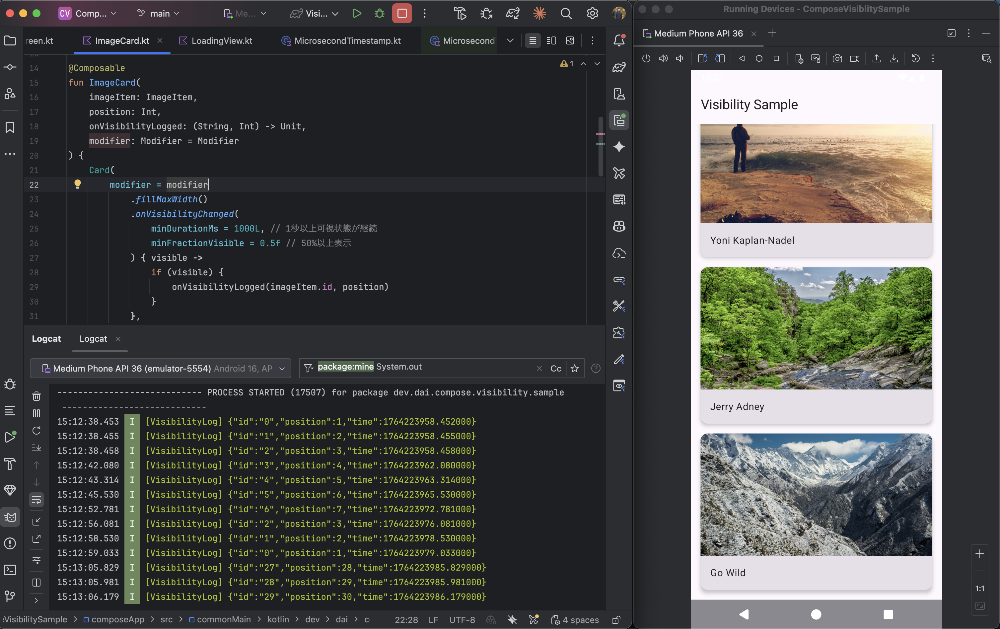

この記事は TimeTree Advent Calendar 2025 の2日目の記事です。

こんにちは、TimeTreeでAndroidエンジニアをしているDannyです。

Jetpack Compose 1.8で、画面上の要素の可視性を効率的に追跡するための新しいAPIが導入されました。<br>
従来、LazyListやスクロール可能なコンテンツ内での要素の表示状態を監視するには、複雑な実装が必要でした。<br>
しかし、onVisibilityChanged、onFirstVisible、onLayoutRectChangedといった新しいModifierにより、広告等のインプレッション計測や動画の自動再生などの一般的なユースケースをシンプルに実装できるようになりました。

本記事では、これらの新しいAPIの基本概念から活用方法を紹介します。

## 従来の可視性追跡の課題

Jetpack Composeでスクロール可能なコンテンツ内の要素が画面に表示されているかを検出する実装は、これまで意外と困難でした。<br>
従来のModifier.onGloballyPositionedを使った方法には、いくつかの課題がありました。

```kotlin
Box(
    modifier = Modifier
        .onGloballyPositioned { coordinates ->
            // 座標から可視性を自前で計算する必要がある
            val bounds = coordinates.boundsInWindow()
            val screenHeight = /* 画面サイズの取得が必要 */
            val isVisible = /* 複雑な可視性判定ロジック */
            
            // 時間による判定も自前実装
            // パフォーマンス最適化も自前実装
        }
)
```

**従来の方法の問題点**

- 画面サイズやスクロールコンテナの情報を別途取得する必要がある
- 可視性の割合計算を自分で実装しなければならない
- 一定時間表示された場合の判定にタイマー処理が必要
- 高頻度で呼ばれるため、適切なデバウンス処理が必須
- コードが複雑になりがちで、バグが混入しやすい

## 可視性追跡が必要となるユースケース例
本記事では、広告等のアクティブビューの視認計測(インプレッション計測)をJetpack Composeの新しいModifier APIを使って実装する例を紹介します。

アクティブビューとは画面上に表示される広告などの特定のViewをユーザーが視認したかどうかということを指します。<br>
これはユーザーが視認できる位置に広告等が表示された頻度を開発者が把握するのに役立つ情報です。

[Media Rating Council](https://mediaratingcouncil.org/) (MRC)のガイドラインでは、視認性の測定における広告の標準仕様が定められています。下記にGoogleの公式ドキュメントにまとめられている定義を引用します。

>ディスプレイ広告は、面積の 50% 以上が画面に 1 秒以上表示された場合に視認可能と見なされます。<br>
242,500 ピクセル以上の大きなサイズのディスプレイ広告の場合は、面積の 30% 以上が画面に 1 秒以上表示されると視認可能と見なされます。

> 動画広告は、面積の 50% 以上が画面に表示された状態で 2 秒以上再生された場合に視認可能と見なされます。

[視認性とアクティブ ビュー レポートの指標について - Google広告 ヘルプ](https://support.google.com/google-ads/answer/7029393?hl=ja&sjid=9283634893124447044-NC)

本記事ではフィード形式のリストを表示するモバイルアプリを題材に、リストのそれぞれのアイテムの50%が1秒以上表示されたらログ送信を発火するという仕様で進めます。

## 新しいVisibility APIの概要

Jetpack Compose UI 1.8では、可視性追跡のための3つの新しいModifierが導入されました。

### onLayoutRectChanged - 基盤となる位置追跡API
要素の画面上での矩形（Rect）が変化したときに通知を受け取る低レベルAPIです。スクロールやレイアウト変更による位置変化を効率的に追跡できます。

パラメータでthrottleとdebounceをミリ秒単位で設定できます。onGloballyPositionedを使うよりもパフォーマンス制御を細かく行えることが利点です。

[リファレンス](https://developer.android.com/reference/kotlin/androidx/compose/ui/layout/package-summary#(androidx.compose.ui.Modifier).onLayoutRectChanged(kotlin.Long,kotlin.Long,kotlin.Function1))

```kotlin
Modifier.onLayoutRectChanged(
    throttleMillis = 16L,  // 最小更新間隔 この時間内の連続した変化は間引かれる
    debounceMillis = 100L  // 変化停止後の待機時間
) { rect ->
    // 画面上の矩形情報を使った独自処理
}
```

### onVisibilityChanged - 可視性変化の監視

要素が画面に表示されているかを自動判定し、可視状態が変わったときに通知します。

minDurationMsで要素が継続して表示されている必要がある最小時間をミリ秒単位で指定できます。<br>
今回の例では1秒以上表示されたらログを送信したいため`1000L`を指定することで実現できます。

minFractionVisibleには表示されている必要がある最小割合を、0.0f〜1.0fの範囲で指定します。デフォルト値の1.0では対象が完全に表示されたらコールバックが発火されます。<br>
今回の例ではリストアイテムの50%以上が表示されたらログを送信したいため`0.5f`を指定することで実現できます。


[リファレンス](https://developer.android.com/reference/kotlin/androidx/compose/ui/layout/package-summary#(androidx.compose.ui.Modifier).onVisibilityChanged(kotlin.Long,kotlin.Float,androidx.compose.ui.layout.LayoutBoundsHolder,kotlin.Function1))

```kotlin
Modifier.onVisibilityChanged(
    minDurationMs = 1000L,      // 最小表示時間
    minFractionVisible = 0.5f   // 最小可視割合（50%）
) { isVisible ->
    if (isVisible) {
        // 条件を満たして表示された
    }
}
```

### onFirstVisible - 初回表示の検出

要素が初めて画面に表示されたときに一度だけ通知します。初回表示時のみログを送信したい場合などで便利です。

[リファレンス](https://developer.android.com/reference/kotlin/androidx/compose/ui/layout/package-summary#(androidx.compose.ui.Modifier).onFirstVisible(kotlin.Long,kotlin.Float,androidx.compose.ui.layout.LayoutBoundsHolder,kotlin.Function0))

```kotlin
Modifier.onFirstVisible(
    minDurationMs = 1000L,
    minFractionVisible = 0.5f
) {
    // 初回表示時の処理（一度だけ実行される）
}
```

## 実際の動作

onVisibilityChanged APIを使ってCard Composableの可視測定をしました。

Zennでは動画のアップロードができないため、画面操作とAndroid StudioのLog出力を収録した動画を以下のYoutube動画リンクから確認できます。<br>
https://youtu.be/a8ahrTC3PDg



サンプルアプリのソースコードは[こちらのGithubリポジトリ](https://github.com/Dai1678/ComposeVisibilitySample)にあります。<br>

### viewportBoundsパラメータの役割

viewportBoundsは、可視性判定の基準となるビューポート（表示領域）を指定するパラメータです。

```kotlin
// ImageListScreen.kt
val viewport = remember { LayoutBoundsHolder() }

LazyColumn(
    modifier = Modifier
        .fillMaxSize()
        .layoutBounds(viewport),  // ←ビューポート領域を記録
    // ...
) {
    itemsIndexed(items = state.images) { index, imageItem ->
        ImageCard(
            viewport = viewport,  // ←記録したビューポートを渡す
            // ...
        )
    }
}
```

```kotlin
// ImageCard.kt
.onVisibilityChanged(
    viewportBounds = viewport,  // ←このビューポート内での可視性を判定
    minFractionVisible = 0.5f,
    // ...
)
```

viewportBoundsが未設定の場合、デフォルトでは画面全体を基準にminFractionVisibleの判定が行われます。<br>
LazyColumnがTopAppBarの下にある場合でも、画面上端からの位置で判定されます。

viewportBoundsをLazyColumnへ紐づけてonVisibilityChanged APIのパラメータとして指定すると、LazyColumnの範囲で可視性が判定されます。以下の図のように、実際の表示領域に基づく判定が行われるようになります。

```
  ┌─────────────────────┐
  │  TopAppBar         │ ← この部分は除外
  ├─────────────────────┤
  │ ╔═════════════════╗ │ ← viewport領域
  │ ║ LazyColumn      ║ │   この範囲内での
  │ ║  • ImageCard 1  ║ │   可視性を判定
  │ ║  • ImageCard 2  ║ │
  │ ║  • ImageCard 3  ║ │
  │ ╚═════════════════╝ │
  └─────────────────────┘
```

## おわりに

Jetpack Compose UI 1.8で導入された画面上の要素の可視性を効率的に追跡するための新しいAPIについて解説しました。

> リストのそれぞれのアイテムの50%が1秒以上表示されたらログ送信を発火

私自身、現在開発している案件でこのログ送信の要件を伝えられたときはどうやって実装しようか不安になりましたが、幸運なことにこのAPIがあったおかげですぐに実装を完成させることができました。

既存で同じような処理を自前で実装しているような人にも恩恵があるものなので、ぜひ参考にしてみてください。
